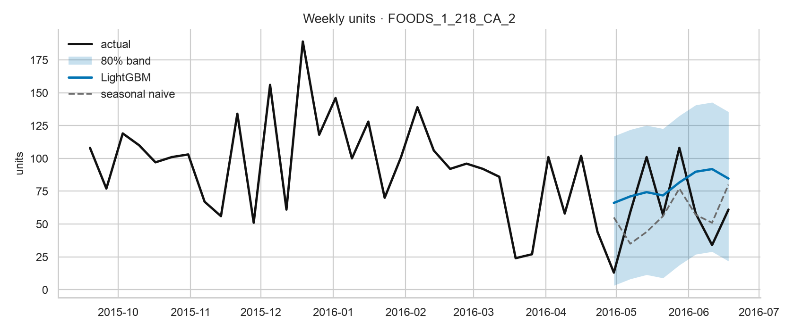
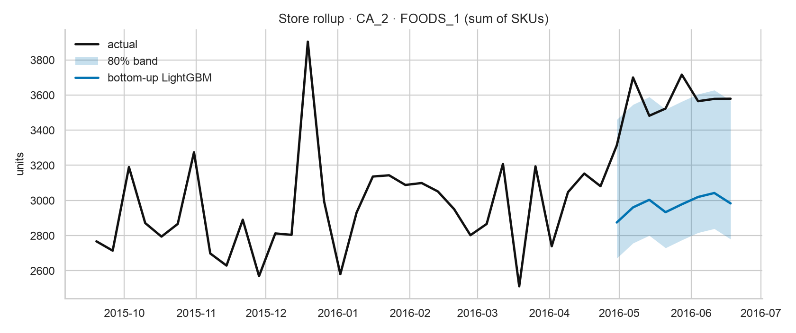
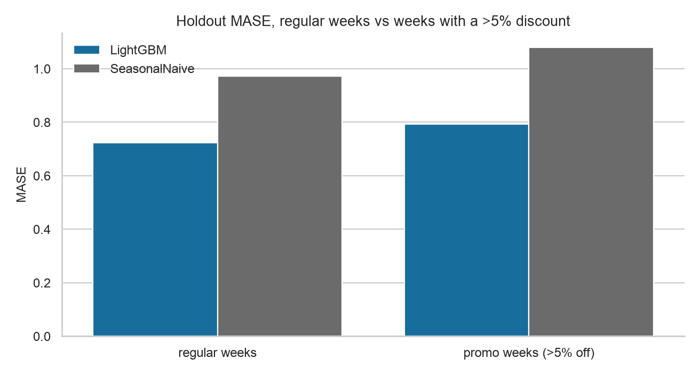
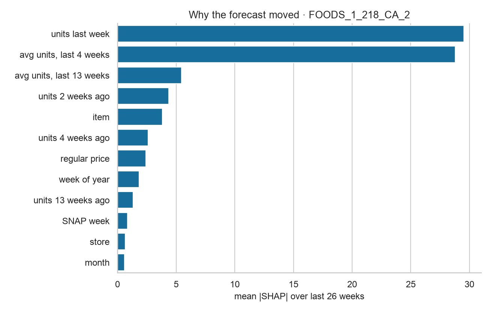
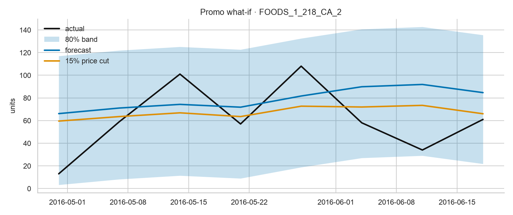

# demand-lab

Weekly SKU-store demand on Walmart M5 (FOODS_1, California). Global LightGBM vs seasonal naive. Five charts, plus numbers `make pipeline` regenerates.

Slice: 805 series, 282 weeks (2011-01-29 to 2016-06-18). Horizon 8 weeks, 4 rolling-origin windows. LightGBM 4.7, mlforecast 1.1, statsforecast 2.1.

```bash
uv sync --python 3.12
make test
make pipeline
```

`make pipeline` writes `reports/metrics.json` and the figures below.

## Forecast vs actual

One high-volume SKU at CA_2. LightGBM follows the recent level. Seasonal naive copies last year. The shaded band is an 80% interval from CV residuals (10th and 90th percentile of actual minus forecast). Spikes inside the band are the noise this SKU already has week to week.



## Store rollup

Same store, all FOODS_1 SKUs summed (bottom-up). CA_2 stepped up in May and June 2016. If the store total sits outside the 80% band, that is a real miss, not a spiky SKU.



## Error on promo weeks

Promo here is a >5% discount vs that SKU's median shelf price. 11.3% of weeks. LightGBM MASE 0.734 overall, 0.724 on regular weeks, 0.792 on promo weeks. Seasonal naive is worse in both buckets.



| model | bucket | MASE | RMSSE | series | rows |
| --- | --- | ---: | ---: | ---: | ---: |
| LightGBM | all | 0.734 | 0.915 | 805 | 25760 |
| LightGBM | regular | 0.724 | 0.905 | 758 | 23974 |
| LightGBM | promo | 0.792 | 0.929 | 82 | 1786 |
| SeasonalNaive | all | 0.984 | 1.258 | 805 | 25760 |
| SeasonalNaive | regular | 0.972 | 1.242 | 758 | 23974 |
| SeasonalNaive | promo | 1.079 | 1.317 | 82 | 1786 |

## Drivers

Tree SHAP (LightGBM `pred_contrib`) on the same SKU, last 26 weeks. Recent units dominate. Regular price and calendar show up. Discount and the promo flag do not make the top twelve.



## Promo what-if

Refit through the last 8 weeks, then score the same weeks with discount +15pp. Forecast went down 14.9%. A global point-forecast model is using price as a level cue. I left the chart in.


